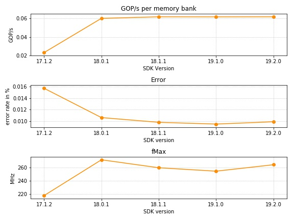

# Benchmark Results

This folder contains the results for the execution of the benchmark using the
`single` kernel on
[Noctua](https://pc2.uni-paderborn.de/hpc-services/available-systems/noctua/)
and the research clusters of the PC2.

### Execution Environment

The used clusters are:
- [Noctua](https://pc2.uni-paderborn.de/hpc-services/available-systems/noctua/): [BittWare 520N board](https://www.bittware.com/fpga/520n/) equipped with
Intel Stratix 10 GX 2800
- [CC](https://pc2.uni-paderborn.de/hpc-services/available-systems/fpga-research-clusters/): [Bittware 385A board](https://www.bittware.com/fpga/385a/) equipped with
Intel Arria 10 GX1150
- [HARP2](https://pc2.uni-paderborn.de/hpc-services/available-systems/fpga-research-clusters/): Intel BDW+FPGA hybrid CPU/FPGA Arria 10 GX1150

Details of the synthesized kernels for all used clusters.
The values for the most important build flags is given.
Also the used compiler versions for host and device and the benchmark version is given for all setups.
The default `AOC_FLAGS` where: `-fpc -fp-relaxed -no-interleaving=default -seed=2809`.

| Parameter         | Noctua                           | CC              | HARP2                            |
|------------------ | -------------------------------- | --------------- | -------------------------------- |
| `BOARD`           | p520_hpc_sg280l/ p520_max_sg280l | p385a_sch_ax115 | bdw_fpga_v1.0                    |
| `AOC_FLAGS`       | default                          | default         | `--fpc --fp-relaxed --seed 2809` |
| `REPLICATIONS`    | 4                                | 2               | 4                                |
| `UPDATE_SPLIT`    | 1024                             | 1024            | 1024                             |
| `GLOBAL_MEM_UNROLL`| 8                               | 8               | 8                                |
| `CXX_FLAGS`       |                                  |                 | `-DNO_CXXOPTS`                   |
| SDK Versions      | 18.0.1, 18.1.1, 19.1.0, 19.2.0   | 17.1.2          | 16.0.2                           |
| GCC Version       | g++ (GCC) 7.3.0                  | g++ (GCC) 5.4.0 | g++ (Ubuntu 4.8.4-2ubuntu1~14.04.4) 4.8.4 |
| BM Version        | `v1.0.0`                         |  `v1.0.0`       |  `v1.0.1-SVM`                    |

For the HARP2 system, the implementation was ported to use SVM in the host code.
The kernel code remained unchanged.

### Result Interpretation

All results are summarized in the given
[CSV](./frandom_single_results.csv) file together with the fMax of the
synthesized kernel.

The benchmark results are also plotted in the figure below.
Note that the SDK version 17.1.2 is not directly comparable with the other
results since another FPGA and board was used.
One difference is the number of memory banks on the board.
For a better comparison of the results the metric _GOP/s per memory bank_ is
used in the plot instead that was calculated as follows: 

