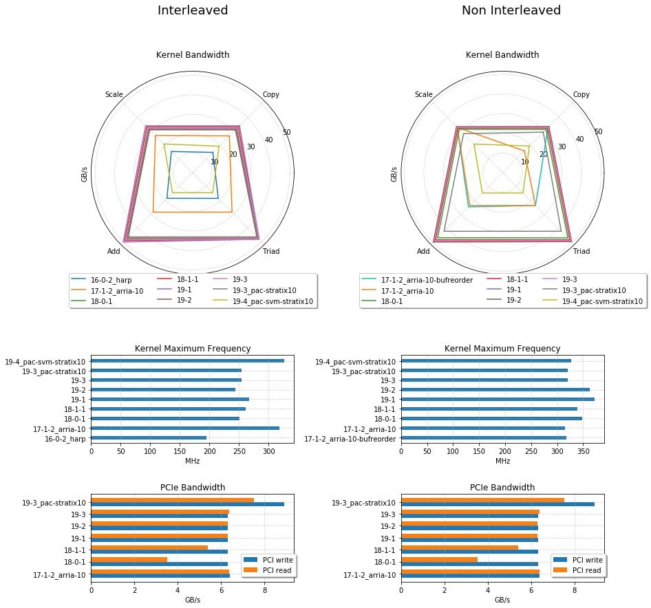
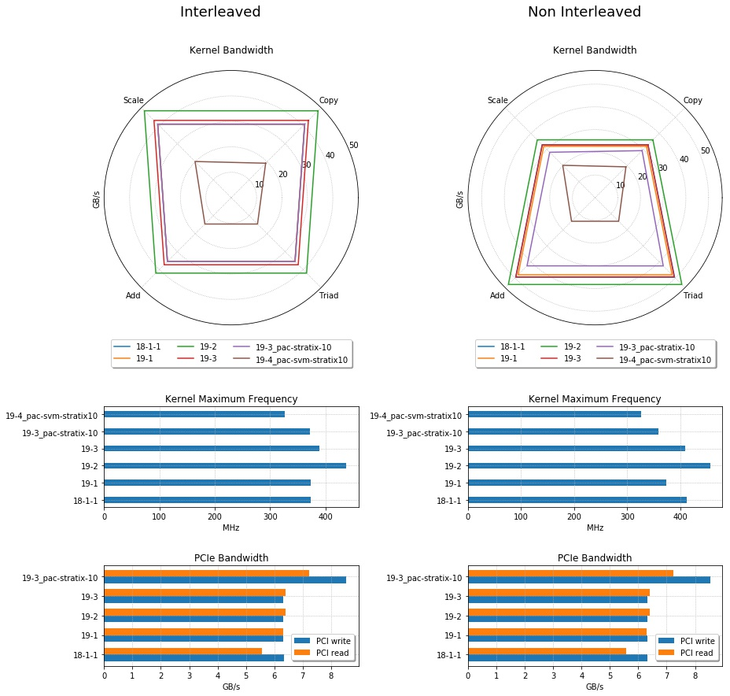
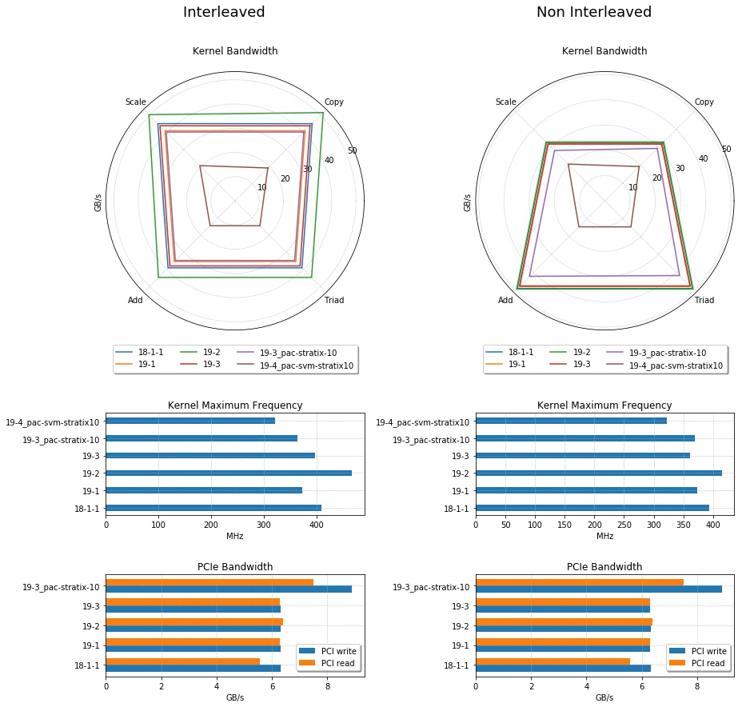

# STREAM for FPGA

This repository contains the STREAM benchmark for FPGA and its OpenCL kernels.
This version adds basic support for the Xilinx Vitis toolcchain.

The implementation is based on the STREAM benchmark 5.10 by John D. McCaplin, Ph.D.
available at [https://www.cs.virginia.edu/stream/](https://www.cs.virginia.edu/stream/).

## Build

CMake is used as the build system.
The targets below can be used to build the benchmark and its kernels:

 |  Target               | Description                                    |
 | --------------------- | ---------------------------------------------- |
 | STREAM_FPGA_`VENDOR`     | Builds the host application linking with the Intel SDK|
 | STREAM_FPGA_test_`VENDOR`            | Compile the tests and its dependencies linking with the Intel SDK  |
 
 More over there are additional targets to generate kernel reports and bitstreams.
 The provided kernel is optimized for the Bittware 520N board with four external
 channels.
 The code might need to be modified for other boards since the external channel descriptor
 string might be different.
 Also the number of channels is hardcoded and has to be modified for other boards.
 The kernel targets are:
 
  |  Target                        | Description                                    |
  | ------------------------------ | ---------------------------------------------- |
  | stream_kernels_`VENDOR`                | Synthesizes the kernel (takes several hours!)  |
  | stream_kernels_report_`VENDOR`         | Just compile kernel and create logs and reports |
  | stream_kernels_emulate_`VENDOR`          | Create a n emulation kernel                    |
  | stream_kernels_single_`VENDOR`                | Synthesizes the kernel (takes several hours!)  |
  | stream_kernels_single_report_`VENDOR`          | Just compile kernel and create logs and reports |
  | stream_kernels_single_emulate_`VENDOR`          | Create a n emulation kernel                    |
  
For the host code as well as the kernels `VENDOR` can be `intel` or `xilinx`.
The report target for xilinx is missing but reports will be generated when the kernel is synthesized.
The `stream_kernels_single` targets build a single kernel for all four vector operations.
In that case the operation will be defined by an additional operation type input parameter.
To use this kernel, run the host code with the parameter `--single-kernel`.

 You can build for example the host application by running
 
    mkdir build && cd build
    cmake ..
    make STREAM_FPGA_intel

You will find all executables and kernel files in the `bin`
folder of your build directory.
Next to the common configuration options given in the [README](../README.md) of the benchmark suite you might want to specify the following additional options before build:

Name             | Default     | Description                          |
---------------- |-------------|--------------------------------------|
`DATA_TYPE`      | float       | Data type used for host and device code |
`VECTOR_COUNT`   | 16           | If >1 OpenCL vector types of the given size are used in the device code |
`DEFAULT_ARRAY_LENGTH`| 134217728 | Length of each input array |
`GLOBAL_MEM_UNROLL`| 1        | Loop unrolling factor for all loops in the device code |
`NUM_REPLICATIONS`| 1        | Replicates the kernels the given number of times |
`DEVICE_BUFFER_SIZE`| 16384        | Number of values that are stored in the local memory in the single kernel approach |

Moreover the environment variable `INTELFPGAOCLSDKROOT` has to be set to the root
of the Intel FPGA SDK installation.

Additionally it is possible to set the used compiler and other build tools 
in the `CMakeCache.txt` located in the build directory after running cmake.

## Execution

For execution of the benchmark run:

    ./STREAM_FPGA_intel -f path_to_kernel.aocx
    
For more information on available input parameters run

    $./STREAM_FPGA_intel -h
    Implementation of the STREAM benchmark proposed in the HPCC benchmark suite for FPGA.
    Usage:
    ./STREAM_FPGA_xilinx [OPTION...]

    -f, --file arg       Kernel file name
    -n, arg              Number of repetitions (default: 10)
    -s, arg              Size of the data arrays (default: 134217728)
    -r, arg              Number of kernel replications used (default: 1)
        --multi-kernel  Use the legacy multi-kernel implementation
        --device arg     Index of the device that has to be used. If not given
                        you will be asked which device to use if there are
                        multiple devices available. (default: -1)
        --platform arg   Index of the platform that has to be used. If not
                        given you will be asked which platform to use if there are
                        multiple platforms available. (default: -1)
    -h, --help           Print this help

    
To execute the unit and integration tests for Intel devices run

    CL_CONTEXT_EMULATOR_DEVICE=1 ./STREAM_FPGA_test_intel -f KERNEL_FILE_NAME
    
in the `bin` folder within the build directory.
It will run an emulation of the kernel and execute some functionality tests.

## Result interpretation

The output of the host application is similar to the original STREAM benchmark:

	Function    Best Rate MB/s  Avg time     Min time     Max time
	Copy:           30875.9     0.025914     0.025910     0.025919
	Scale:          30885.6     0.025905     0.025902     0.025911
	Add:            46289.2     0.025928     0.025924     0.025935
	Triad:          45613.4     0.026310     0.026308     0.026312
	PCI Write:       6324.0     0.189800     0.189753     0.189862
	PCI Read:        5587.3     0.214869     0.214773     0.214943

In addition it also measures the bandwidth of the connection between host and
device. It is distinguished between writing to and reading from the devices
memory.
The buffers are written to the device before every iteration and read back
after each iteration.

## Exemplary Results

The benchmark was executed on Bittware 520N cards for different Intel® Quartus® Prime versions.
The detailed results of the runs are given in [results.txt](results.txt) and as
CSV files in the subfolder `csv_result_export`.

#### Single Precision

#### Double Precision

#### Usage of the Global Ring

It is possible to force a ring interconnect for the global memory with the compiler command
`-global-ring`. To test the impact of this type of interconnect, the benchmark was also 
synthesized with the additional parameters `-global-ring -duplicate-ring` for all SDK versions
supporting this option.

The raw data of these runs can be found in the folder `csv_result_export`.

##### Single Precision

##### Double Precision
