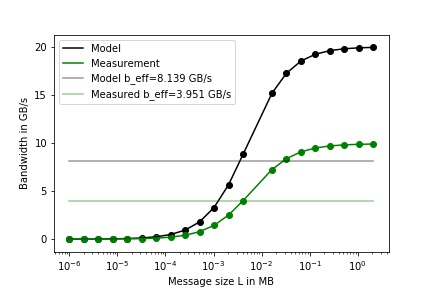

# Benchmark Performance

This subfolder contains a performance model together with the expected performance for 
different configurations on a Stratix 10 FPGA.

## The Algorithm

The kernel of the benchmark will send and receive data over the external channels of the FPGA using
21 different message sizes _L_.
They are defined like the following:

,4kB*(a^2),\dots,4kB*(a^8))
where `a` is a integer constant that is set to 2 in this implementation.

The FPGAs are using a Circuit-Switched-Network for communication.
So the random topology does not affect the performance since the the network topology can always be
adjusted to physically recreate the rings.
Also different ring sizes do not matter because of the same reason.
So the six different topologies of the original benchmark can be reduced to just a single topology.

Since we only use one topology the equation for the effective bandwidth shrinks to:

    b_eff = sum_L(max_rep(b(L, rep))) / 21
    
where b(L, rep) is the measured bandwidth for a data size `L` in repetition `rep`.
    
The `looplength` described in the original benchmark will be used to minimize measurement 
errors caused by too short runtimes.
It specifies the total number of message exchanges that will be done with a certain message size.
It may vary between message sizes to achieve similar runtimes independent of the message size.

The bandwidth will be calculated by measuring the execution time `t_exe` of the kernel and calculate
the total number of bytes transmitted.

    b(L) = (L * looplength) / t_exe
    
The aggregated bandwidth is then calculated with:

    b_eff = sum_L(b(L)) / 21

#### Kernel Implementation

A bitstream will contain two identical kernels that have to be connected to different
external channels to form the desired topologies.
The kernel executes the following:

```
def kernel(size, looplength):
        const iterations = ceil(size / (#channels * channel_width))
        for 1..looplength:
            for 1..iterations:
                send and receive on all assigned channels in parallel
```

`channel_width` and `#channels` depend on the hardware specification of the external channels.
In the original benchmark `looplength` is calculated depending on the time off a single message
exchange. In practice it must be sufficiently large to reduce te measurement error for small data
sizes.
Both kernels take the used data size and the loop length as parameters.

The bitstream will contain both kernels and they will be executed in parallel on multiple FPGAs.
An example for the external channel setup between two FPGA is given below:

```
     FPGA 1            FPGA 2
     .....     CH1     .....
    |send | --------- |recv |
    |     |    CH3    |     |
    |send | --------- |recv |
    |     |    CH2    |     |
    |recv | --------- |send |
    |     |    CH4    |     |
    |recv | --------- |send |
     .....             .....
```
where `send` is the send kernel and `recv` the receive kernel. 

## Performance Model

The following performance model is based on the pseudo code of the previous chapter.
So we have a send kernel and a receive kernel on each device and thus can send and receive in parallel.
They will be used to connect to the left-hand and right-hand neighbor in the ring topology.

For the performance model we first need to model the runtime of the kernel for a given data size and
`looplength`.

We will model the performance for the BittWare 520N cards equipped with Intel Stratix 10 FPGAs.
From the BittWare OpenCL S10 BSP Reference Guide we get the following relevant metrics for 
external channels:

    Number of external: channels c = 4 
    channel latency: c_latency = 520ns
    channel clock frequency: c_frequency = 156.25MHz
    channel width: c_width = 256bit

We divide the available channels between the two kernels so every kernel will just have `c = 2` channels
for transmission.
The kernel execution time can then be calculated using the constants above and the used message size
`L` and the number of message exchanges `i`:

&space;*&space;i}{c_{frequency}}&space;&plus;&space;i&space;*&space;c_{latency})

With that we can calculate the bandwidth with:


The number of iterations can be removed from the equation for the model since we do not need to care about measurement 
inaccuracy. So the equation reduces to:


when inserting all constant values for the Bittware 520N board we get:

}{156.25MHz}+520ns})

where everything except `L` is constant.
This results in the following bandwidth depending on the used message sizes for a kernel that uses two channels for transmission:


The effective bandwidth for a single kernel pair is then calculated with:


over all `L`.

Considering the model the predicted effective bandwidth for the BittWare 520N card will be ~8.17  GB/s per kernel pair.
Since all additional kernel pairs will have their own dedicated channels for communication the effective bandwidth is expected
to scale linearly with the number of kernel pairs `n` which is the same as the number 
 of used FPGA.
 So we can calculate the effective bandwidth for the whole network with:
 
 

where `n` is the number of FPGA used in the network.

## Measurement Results

The benchmark was synthesized for the Bittware 520N board with the following configuration:

Name             | Default     | Description                          |
---------------- |-------------|--------------------------------------|
`DEFAULT_DEVICE` | -1          | Index of the default device (-1 = ask) |
`DEFAULT_PLATFORM`| -1          | Index of the default platform (-1 = ask) |
`DEFAULT_REPETITIONS`| 10          | Number of times the kernel will be executed |
`FPGA_BOARD_NAME`| p520_max_sg280l | Name of the target board |
`CHANNEL_WIDTH`  | 32          | The width of a single channel in bytes. |
`AOC_FLAGS`| `-fpc -fp-relaxed -no-interleaving=default` | Additional AOC compiler flags that are used for kernel compilation |

The used tool versions where:

Tool             | Version |
---------------- |---------|
Intel OpenCL SDK | 19.4.0  |
BSP              | 19.2.0  |
OpenMPI          | 3.1.4   |
GCC              | 8.3.0   |


The output of a test run on a single FPGA:

        MSize      looplength        transfer             B/s
            1           16384     2.02084e-02     1.62150e+06
            2           16384     2.02076e-02     3.24313e+06
            4           16384     2.02078e-02     6.48621e+06
            8           16384     2.02082e-02     1.29722e+07
           16           16384     2.02075e-02     2.59453e+07
           32           16384     2.02074e-02     5.18907e+07
           64           16384     2.02074e-02     1.03781e+08
          128           16384     2.03811e-02     2.05794e+08
          256           16384     2.08290e-02     4.02737e+08
          512           16384     2.17212e-02     7.72389e+08
         1024           16384     2.34488e-02     1.43097e+09
         2048           16384     2.67959e-02     2.50444e+09
         4096           16384     3.35864e-02     3.99620e+09
        16384           16384     7.41481e-02     7.24052e+09
        32768           16384     1.28218e-01     8.37438e+09
        65536           16384     2.36447e-01     9.08229e+09
       131072           16384     4.52898e-01     9.48329e+09
       262144           16384     8.85840e-01     9.69693e+09
       524288           16384     1.75159e+00     9.80814e+09
      1048576           16384     3.48309e+00     9.86474e+09
      2097152           16384     6.94615e+00     9.89317e+09

    b_eff = 3.95057e+09 B/s
    
It can be observed, that the bandwidth is half of the bandwidth predicted by the model.
The reason for that is, that the send and receive loop in the kernel are executed sequentially.
This means the kernel is only sending half of the measured time although there is no direct dependency between the loop in a single iteration.
The model and the measurement together with their effective bandwidth is given in the following figure:



Changing the model to match the behavior of the synthesized bitstream leads to the following runtime function:

&space;*&space;i}{c_{frequency}}&space;&plus;&space;i&space;*&space;c_{latency}\))

Now the time is doubled since a message exchange includes sending and then receiving a message sequentially.
The effective bandwidth of the model is now 4.07 GB/s, which means an residual error of 3% the performance model to the actual measurement.

#### Scaling

Scaling the benchmark to 8 FPGAs on four different nodes gives the following result:

        MSize      looplength        transfer             B/s
            1           16384     2.16071e-02     1.21323e+07
            2           16384     2.16078e-02     2.42639e+07
            4           16384     2.16072e-02     4.85291e+07
            8           16384     2.16072e-02     9.70579e+07
           16           16384     2.16080e-02     1.94109e+08
           32           16384     2.16077e-02     3.88224e+08
           64           16384     2.16064e-02     7.76494e+08
          128           16384     2.17348e-02     1.54381e+09
          256           16384     2.21099e-02     3.03525e+09
          512           16384     2.29710e-02     5.84292e+09
         1024           16384     2.46347e-02     1.08967e+10
         2048           16384     2.80785e-02     1.91204e+10
         4096           16384     3.47917e-02     3.08620e+10
        16384           16384     7.54236e-02     5.69446e+10
        32768           16384     1.29557e-01     6.63023e+10
        65536           16384     2.37797e-01     7.22459e+10
       131072           16384     4.54291e-01     7.56337e+10
       262144           16384     8.87293e-01     7.74485e+10
       524288           16384     1.75325e+00     7.83910e+10
      1048576           16384     3.48511e+00     7.88720e+10
      2097152           16384     6.94855e+00     7.91180e+10

    b_eff = 3.13237e+10 B/s
    
The effective bandwidth is 31.13 GB/s, which is close to the model with 8 * 4.07 GB/s = 32.56 GB/s.
So the implementation seems to scale well over multiple FPGA.