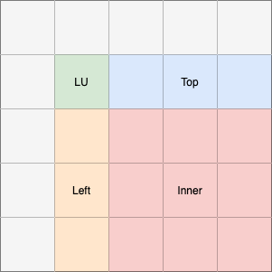
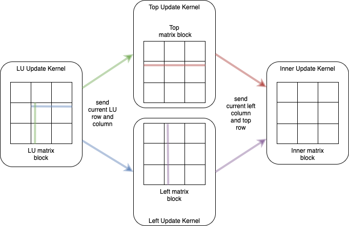
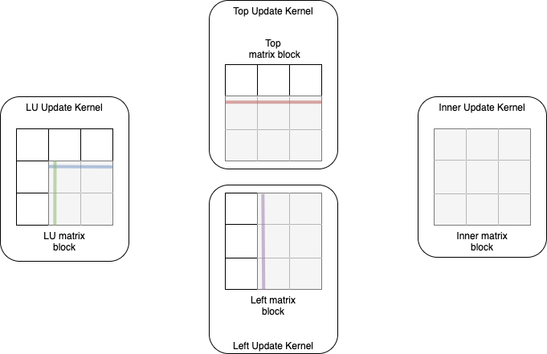
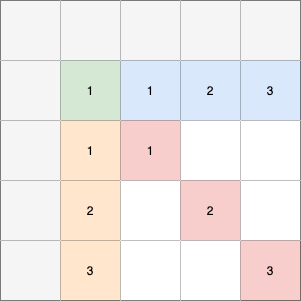
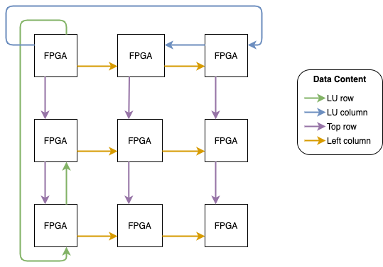
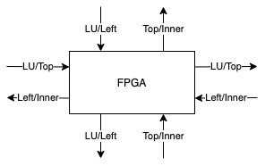

-----------------------
Implementation Details
-----------------------

The FPGA design for the LINPACK kernel supports the calculation of a large equation system over mutliple FPGAs. The FPGAs need to be connected via a 2D-torus
network with bi-directional links but is also possible to use the implementation with only a single FPGA. Every FPGA will use the same design consisting of multiple 
kernels for the calculation. It is the task of the CPU to create a custom execution plan for every FPGA depending on their position in the 2D-torus before the actual 
execution. Before we look into the execution of the design in a inter-FPGA network, we will discuss the execution on a single FPGA and the general kernel design with focus
on the LU factorization since this is the most compute-intensive part of LINPACK.

A important restriction of the design is that the LU factorization requires a diagnonally dominant matrix because pivoting is not implemented in any form.

Kernel Design for LU Factorization
----------------------------------

The implementation uses a blocked, right-looking variant for the LU factorization as it is described in [DHW98]_.
For the update of a single row and column of blocks, we need to perform four different operations which a shown as colors in :numref:`lu_operations`.
In every iteration, the LU factorization for a block in the diagonal of the matrix is calculated which is marked green in the visualization.
All grey-colored blocks on the left and top of this block are already updated and will require no further processing.
The resulting lower matrix :math:`L` is used to update all blocks on the right of the LU block. Since they are the top-most blocks which still require an update, they are in the following called _top-blocks_. 
The upper matrix :math:`U` is used to update all blocks below the current LU-block. These are the left-most blocks which require an update so they are called _left-blocks_ in the following.
All other blocks are updated using the results of the left- and top-blocks.

.. _lu_operations:

  Visualization of the operations performed on different blocks of the matrix in a single iteration. The grey blocks will not be updated in the iteration.

The decribed operations are implemented in four separate kernels.
To make the best use of the hardware, all four kernels are executed simultaneoulsy and data is streamed through the kernels using a row-wise exchange-and-update-approach.
Data is forwarded using channels and the required routing of data is handeld by a fifth kernel.
Every calculation kernel will load a single block of the matrix into a local memory buffer and perform the update.
The size of the block that will be loaded to local memory can be speicified with the ``LOCAL_MEM_BLOCK_LOG`` parameter, which is the logarithm of base two of the width of the block in number of values.
It will affect the local memory usage of the design and also the performance because larger buffer sizes will increase the utilization of the calculation pipeline.
Additionally, all kernels use a second level block-based approach to update the local memory block.
The block size for the second level can be specified with ``REGISTER_BLOCK_LOG``.
This parameter takes effect on the amount of calculations that will be done in parallel. 
The pipeline will issue the update of one second level block per clock cycle.

The execution of the kernels is divided into two steps which are repeated for every row in the block: The *exchange* and the *update* phase.

.. _kernel_exchange:

  Visualization of the kernel communication and the matrix blocks during the exchange phase. Every kernel will have a matrix block in a local memory buffer. These blocks are divided into smaller sub-blocks for the computation. Only single rows and columns are exchanged between the kernels. Note, that for the LU kernel only a part of the row and column are exchanged depending on the sub-block size.

A visualization of the exchange phase is given in :numref:`kernel_exchange`_.
All kernels will load a block of the matrix into the local memory buffer. The update will be executed row- or column-wise -- depending on the kernel.
The LU kernel sends the current, already updated row and column to the kernels working on the top and left block. 
They will use the data to update their current row or column and forward it to the kernel updating the inner block.
Additionally, the kernels will store the received row and column in a global memory buffer which sustains between kernel executions.
This buffer will be used to update additional left and top blocks after the LU block was already updated.
So the exchange phase will be the same, except that the LU kernel will not be executed anymore.
The inner-kernel will only receive the row and column from the other kernels and also store them in global memory.

So the exchange phase will be used to do the following:
  - The current updated row and column of the LU block are forwarded to the left- and top-block kernel.
  - The left- and top-block kernel forward their updated row and column to the inner-kernel and store the received data of the LU block in a global memory buffer
  - The inner-kernel receives the current row and column and stores them in global memory buffers

.. _kernel_update:

  Visualization of the update step. Every kernel updates the sub-blocks that are colored grey with the data received in the previous exchange step.

During the update step, which can be seen in :numref:`kernel_update`_, the kernels do not communicate at all, but use the previously received data to update their block in local memory.
This is done in the granularity of sub-blocks, so the LU, left and top kernel will only need to update a part of the block, depending on the current row.
Only the inner block will always need to update all sub-blocks. This is why this kernel will be the bottleneck in this calculation step.
All kernels will need to wait for the inner kernel to complete the update until a new exchange phase can start.

The steps in which the blocks are updated can be seen in :numref:`lu_operations_steps`.
After the first execution of all four kernels, four blocks of the matrix will be completely updated for the current iteration.
These blocks are labelled with _1_ in the figure.
Still, if the matrix consists of more than four blocks, additional updates are necessary.
The data stream described above will be executed again but without the LU-block kernel.
Instead, the left- and top-block kernels will read the upper and lower matrix from the global memory buffer that was mentioned in the exchange phase.
After the first execution of the left and top update, these buffers will contain the complete upper matrix for the left-kernel and lower matrix for the top-kernel.
In step two and three, only the top, left and inner kernel will be executed and the exchange step will be used to do the following:

- The left- and top-block kernel forward their updated row and column to the inner-kernel and read the LU data from the global memory buffer
- The inner-kernel receives the current row and column and stores them in global memory buffers

The update phase will stay the same.

.. _lu_operations_steps:

  Required steps to update the whole top row and left column. The colored blocks will be updated after this phase. Blocks with the same number will be updated in the same step. The white blocks remain unmodified for now.

After three executions of the kernels, only inner blocks are left to be updated.
This will be the majority of blocks for large matrices because the number of inner blocks increases quadratically with the matrix size.
To speed up the update of the remaining blocks, an additional kernel is used. 
It updates the current block by multiplying whole sub-blocks with each other.
The column of left blocks and the row of top blocks of the current iteration are stored in the global memory buffers mentioned in the exchange steps.
Now they are used as input to update the inner blocks which also means that the kernel does not require any communication.
The performance of the design can be further improved by adding more kernel replications of the matrix multiplication kernel using the parameter ``NUM_REPLICATIONS``. 
A replication of the streaming kernels does not bring much benefit because the data dependencies in the LU kernel do not allow arbitrary parallelization.

Multi-FPGA Implementation
-------------------------

.. _fpga_2d_torus_data:

  Communication between the FPGAs in a 2D torus for a single iteration of the algorithm where every FPGA needs to update multiple blocks. The FPGA in the top left will calculate the LU block. The colors of the arrows show the type of the data that is forwarded in the torus and the colored blocks in the FPGAs show the active kernels.

In :numref:`fpga_2d_torus_data`, the data which is forwarded in the exchange phases as well as the active kernels are shown.
The matrix is distributed between the FPGAs using a PQ grid to balance the workload between the FPGAs.
The FPGA in the top left will use all four streaming kernels (LU, left, top, inner) and forward the LU row and column as well as the row and column of the updated left and top block.
The FPGAs at the top will execute the top and inner kernel, the FPGAs on the left the left and inner kernel. All remaining FPGAs will only execute the inner kernel.
Note, that the left column and the LU column are forwarded in opposite directions. This allows a better utilization of the bidirectional channels between the FPGAs
and the simultaneous data exchange of all kernels.
Also, the LU row and column are forwarded internally within the top-left FPGA. This is why it is not necessary to forward it from the FPGA below or at the right.
The internal forwarding is used to remove circular data dependencies in the torus which otherwise would lead to increased stalls in the network kernel.

In the next iteration, the FPGA in the center will take the role of the LU update because it will own the next diagonal block of the matrix. This means in every iteration the roles will shift one step to the bottom-right.
The usage of the different external channels by the four streaming kernels is shown in :numref:`fpga_external_channels`.
Every channel is used by exactly two kernels. However, these kernels will never conflict in the channel access, because data will be forwarded internally if both kernels are active.

 .. _fpga_external_channels:

  Every FPGA is connected to four other FPGAs over the bidirectional external channels. Every channel direction takes over a certain role and does only forward a single type of data. This means that multiple kernels need to read and write to each external channel.

.. [DHW98] Dongarra, J. J., Hammarling, S., & Walker, D. W. (1998). Key concepts for parallel out-of-core LU factorization. Computers & Mathematics with Applications, 35(7), 13-31.

