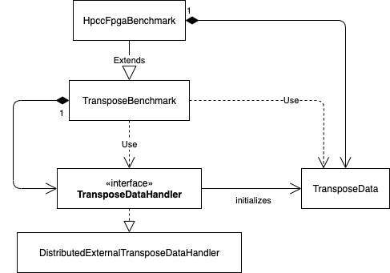
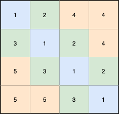

.. _ptrans:
======
PTRANS
======

This benchmark calculates a distributed blocked matrix transposition with :math:`C = B + A^T` where :math:`A,B,C \in \Bbb R^{n \times n}`.
So, a matrix :math:`A` is transposed and added to another matrix :math:`B`. The result is stored in a separate buffer.
All matrices are divided into blocks and the blocks are distributed over multiple FPGAs, so the FPGA will need to complete the calculation
using an inter-FPGA network.

The benchmark is designed to be easily extendable with different distribution schemes on the host side.

.. toctree::
   :maxdepth: 2
   :caption: Contents:
   :glob:

   */index

------------------------
Configuration Parameters
------------------------

In :numref:`ptrans_config` the configuration parameters are shown that are used to modify the kernel. 
All other parameters can also later be changed with the host code during runtime. 

.. _ptrans_config:
.. list-table:: Configuration parameters for the Kernel
   :widths: 15 25
   :header-rows: 1

   * - Parameter
     - Description
   * - ``NUM_REPLICATIONS``
     - Replicates all kernels the given number of times. This allows to create a kernel pair for every available external channel in case of the circuit-switched network.
   * - ``BLOCK_SIZE``
     - Size of the matrix blocks that are buffered in local memory and also distributed between the FPGAs.
   * - ``CHANNEL_WIDTH``
     - Width of the channels in data items. Together with the used data type, the width of the channel in bytes can be calculated.
   * - ``DATA_TYPE``
     - Specifies the used data type for the calculation.

--------------------
Detailed Description
--------------------

As mentioned at the beginning, the host code of this benchmark is designed to support different data distribution schemes between the FPGAs.
The performance models for the supported models are given in the following sections. In this section, it is focussed on the part of
the implementation that is common for every distribution scheme, which will be parts of the host code and the kernel signature.

.. _handler_class:

  
  Class diagram showing the integration of the ``TransposeDataHandler`` interface into the implementation of the host code

An overview of the structure of the host code is given in :numref:`handler_class`.
Different host processes are communicating using MPI to allow scaling over multiple FPGAs, which may be installed on different nodes in a compute cluster.
Every MPI rank is in charge of a single FPGA and all objects shown in the figure are created on every MPI rank.
This means, the data handler and the generated data may differ between the MPI ranks depending on the chosen distribution scheme.
Therefore, the implementation introduces a new interface: ``TransposeDataHandler``. 
Implementations of this interface are managing the initialization of the ``TransposeData`` object for a given MPI rank, 
which again holds the allocated memory for the kernel execution on the FPGA.
The data on each rank is implemented as a one-dimensional array of matrix blocks.
This allows to reuse the validation mechanism, independent of the chosen data distribution scheme.
In the current state, only one implementation for the ``TransposeDataHandler`` exists, which will distribute the blocks diagonally
and is named ``DistributedDiagonalTransposeDataHandler``.
One big advantage of this data distribution scheme is the possibility to create very simple circuit-switched networks for the data exchange.

-------------------------------------------
Performance Model for Diagonal Distribution
-------------------------------------------

The diagonal distribution tries to create pairs of FPGAs that hold each other's blocks of the transposed matrix A.
This allows to set up a static circuit-switched network between the pairs and exchange the matrix blocks without additional routing.
A visualization for the data distribution of a 4-by-4-block matrix is given in :numref:`diagonal_distribution`.
The FPGA rank is given by the number in the block, the color specifies the communication pairs necessary to exchange the block information.
Also note, that the FPGA with rank 1 will need to process one block more than the other FPGAs.
This is required because the diagonal blocks need different processing than the other blocks: The transposed block of A needs to be added to the block B in the same position, so no communication for the exchange of the block is required.
The host code will take care of this requirement when distributing the blocks to the MPI ranks.
Moreover, the host will also try to distribute the blocks evenly between the ranks under the given restrictions.

.. _diagonal_distribution:

  
  Diagonal distribution of the blocks of the 16 blocks of a 4x4 matrix on five FPGAs. The number in the block represents the FPGA the block is distributed to. Communication pairs are represented by the block colors, so FPGAs with blocks of the same color will form communication pairs. Note, that the FPGAs that are in charge of the diagonal blocks will send the data to themselves.

The FPGA logic is implemented in two kernels per external channel. The number of kernel pairs can be defined with the ``NUM_REPLICATIONS`` parameter.
Moreover, the external channels in a circuit-switched network have a fixed width (e.g. 256 bit). The kernels can be adapted to this width
by specifying the channel width in the number of data items with the ``CHANNEL_WIDTH`` parameter together with the ``DATA_TYPE``.

One of the kernels will read a block of A into local memory using chunks of ``CHANNEL_WIDTH`` data items. The size of this local memory buffer can be defined with the ``BLOCK_SIZE`` parameter
which represents the size of the quadratic matrix blocks in the number of values.
Note, that the block sizes have to match the block sizes used on the host side!
The block of matrix A is then read transposed from local memory and sent over the external channel.
Reading from global memory and writing to the external channel is implemented in a single pipeline using double buffering for the local memory block.
If the width of the global memory interface and the channel width are not matching, this may lead to inefficient global memory accesses.
Usually, this will not affect the performance of the kernel, since the performance will be bound by the external channel bandwidth.

The second kernel will receive chunks of a transposed block of A, add a block of B to it and store it in global memory.
So the result will immediately be stored in global memory and no local memory is needed in this kernel.
One major goal of this implementation is, to continuously send and receive data over all available external channels and by that to fully utilize the
available network bandwidth.
Nevertheless, the kernels may also suffer from low memory bandwidth since the need to read and write to three different buffers for every kernel pair replication.
This leads to a total required global memory bandwidth of :math:`mem_{global} = 3 \cdot r \cdot c_w \cdot d_w \cdot f_{channel}` where 
:math:`r` the number of external channels per FPGA (or number of kernel pair replications), :math:`f_{channel}`  the frequency of the external channel, :math:`c_w` the width of an external channel in number of data items
and :math:`d_w` the size of a single data item in bytes.
In short, the required global memory bandwidth is three times higher than the network bandwidth to keep the benchmark network-bandwidth bound.

For an arbitrary large matrix, the expected maximum performance will be :math:`flops = n \cdot r \cdot f_{channel} * c_w` where :math:`n` is the number of FPGAs,
:math:`r` the number of external channels per FPGA (or number of kernel pair replications), :math:`f_{channel}` the frequency of the external channel and :math:`c_w` the width of an external channel in number of data items.

A second version of the implementation uses two external channels per kernel pair. This allows to increase the width of the LSUs to global memory and at the same time half the required number of kernel replications.
Note, that this implementation will in some cases lead to a more severe imbalance in read and write accesses per memory bank. Using the memory interleaving mainly resolves this issue.
The model for the expected maximum performance stays the same.
