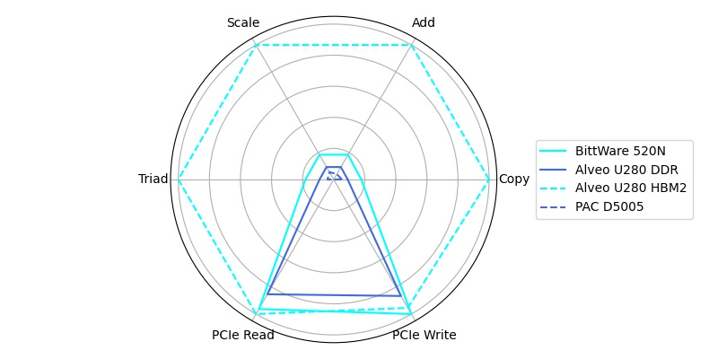

=============================
STREAM FPGA Benchmark Results
=============================

The benchmark results are given divided by the used version of the benchmark, since internal changes in the benchmark code might lead to different performance results.
All performance measures are given in GB/s and the measurements were done with data arrays of 2GB.
The measurements were executed 10 times and the best result is published.

The results and the used configuration is given in :numref:`tbl_stream_2_3_results` and are also available as :download:`CSV <stream-2-3.csv>`.

.. _stream_result_plot:

  Radar plot of the normalized measurement results for all benchmarked FPGA boards 

.. _tbl_stream_2_3_results:
.. csv-table:: STREAM FPGA Benchmark Results for version 2.3
    :file: stream-2-3.csv
    :stub-columns: 1

