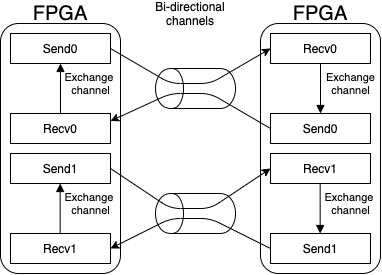

.. _beff: 
=======
b_eff
=======

This section contains all information related to the network bandwidth benchmark.

.. toctree::
   :maxdepth: 2
   :caption: Contents:
   :glob:

   */index

------------------------
Configuration Parameters
------------------------

In :numref:`beff_config` the configuration parameters are shown that are used to modify the kernel. 
All other parameters can also later be changed with the host code during runtime. 

*Note: The current implementation is optimized for circuit-switched networks with four channels. Packet-switched networks might need a different kernel architecture. This specialization is the reason for the low amount of configuration parameters which might change, if more systems with inter-FPGA communication are available.*

.. _beff_config:
.. list-table:: Configuration parameters for the Kernel
   :widths: 15 25
   :header-rows: 1
   :align: center

   * - Parameter
     - Description
   * - ``CHANNEL_WIDTH``
     - Width of an external channel in bytes.

--------------------
Detailed Description
--------------------

The b_eff implementation for FPGA is based on the `effective bandwidth benchmark <https://fs.hlrs.de/projects/par/mpi//b_eff/>`_ that uses MPI to measure the network bandwidth using different message sizes.
The basic idea behind the benchmark is to combine both, the network latency and bandwidth, into a single metric: the effective bandwidth.
It is a metric that combines the network bandwidth measured for a wide range of message sizes to allow an estimation of how the network will react to different application scenarios.
The benchmark works mainly within a ring topology. Positions in the ring will be assigned at random.
For the use with a circuit-switched network, the benchmark rules were slightly adapted and simplified because routing does not take place in the network.
Instead, the communication links between the FPGAs are set up directly before execution in the required topology.

The benchmark works on 21 different message sizes :math:`L` that are defined like this:

.. math::
   L=1B,2B,4B,\dots,2kB,4kB,4kB*(a^1),4kB*(a^2),\dots,4kB*(a^8)

where :math:`a` is an integer constant that is set to 2 in this implementation.
So the final message sizes will be in the range :math:`2^0, 2^1, \dots, 2^{20}` bytes.
The maximum message size can be adjusted during runtime using the host code flag ``-m``.

Since we only use one topology the equation for the effective bandwidth shrinks to:

.. math::
    b_{eff} = sum_L(max_{rep}(b(L, rep))) / 21
    
where b(L, rep) is the measured bandwidth for a data size :math:`L` in repetition :math:`rep`.
    
The `looplength` described in the original benchmark will be used to minimize measurement 
errors caused by too short runtimes.
It specifies the total number of message exchanges that will be done with a certain message size.
It may vary between message sizes to achieve similar runtimes independent of the message size.
In the current implementation, the final loop length will be calculated based on an initial maximum loop length that can be given during runtime.
The number of repetitions for each message size is then calculated with the following equation:

.. math::
   max(\frac{u}{\lceil\frac{m}{2 \cdot CHANNEL\_WIDTH}\rceil}, l)

were :math:`u` is the upper/maximum loop length that should be used and :math:`l` the lowest. :math:`m` is the current message size in bytes
and :math:`CHANNEL\_WIDTH` the width of the communication channel in bytes.

The bandwidth will be calculated by measuring the execution time :math:`t_{exe}` of the kernel and dividing the measured time by the total number of transmitted bytes.

.. math::
    b(L) = \frac{L \cdot looplength}{t_{exe}}
    
The aggregated bandwidth is then calculated with:

.. math::
    b_{eff} = \frac{sum_L(b(L))}{21}

----------------------
Implementation Details
----------------------

The implementation consists of two different kernel types: a `send` kernel and a `receive` kernel.
During execution, they continuously send or receive data over two external channels.
Because the message size might exceed the width of the channels, the messages are further divided into data chunks that match the channel width.
Thus, a message is streamed chunk-wise over two channels to the receiver in a pipelined loop.
At kernel start, the `send` kernel will generate a message chunk that is filled with bytes of the value :math:`ld(m) mod 256`.
The message chunk will be used continuously for sending and will be stored in global memory after the last transmission.
This allows verifying the correct transmission of the data chunk over the whole range of repetitions.

A schematic view of the channel connections for the kernel implementation is given in :numref:`network_kernel_flow`.

.. _network_kernel_flow:

  The different kernels of the implementation are connected over bidirectional external channels to kernels running on other FPGAs. It this example two FPGAs form a bidirectional ring and will send and receive data from the other FPGA.

The host code will start all kernels simultaneously and measure the time until all kernels are finished and use this time to calculate the achieved bandwidth for the execution.
Overall, the kernels will be executed sequentially for all message sizes and the host processes will be synchronized with an MPI barrier before every execution.

------------------
Performance Model
------------------

The following performance model is based on the implementation description given in the previous section.
So we have two send-kernels and two receive-kernels on each device and thus can send and receive in parallel.
They will be used to connect to the left-hand and right-hand neighbor in the ring topology.

For the performance model, we first need to model the runtime of the kernel for a given data size and
`looplength`.

We will model the performance for the BittWare 520N cards equipped with Intel Stratix 10 FPGAs.
From the BittWare OpenCL S10 BSP Reference Guide we get the following relevant metrics for 
external channels:

.. csv-table:: Relevant metrics for the external channels on the BittWare 520N board
   :header-rows: 1
   :align: center

   Description,Value
   Number of external channels, :math:`c = 4` 
   channel latency, :math:`c_{latency} = 520ns`
   channel clock frequency, :math:`c_{frequency} = 156.25MHz`
   channel width, :math:`c_{width} = 256bit`

We divide the available channels between the two kernels so every kernel will just have `c = 2` channels
for transmission.
The kernel execution time can then be calculated using the constants above and the used message size
:math:`L` and the number of message exchanges :math:`i`:

.. math::
   t_{L, i} = \frac{\lceil\frac{L}{c * c_{width}}\rceil * i}{c_{frequency}} + i * c_{latency}

This can be further used to calculate the bandwidth with:

.. math::
   b_{L, i} = \frac{2 * L * i}{t_{L, i}}

The number of iterations can be removed from the equation for the model since we do not need to care about measurement 
inaccuracy. So the equation reduces to:

.. math::
   b_{L} = \frac{L}{\frac{\lceil\frac{L}{c * c_{width}}\rceil}{c_{frequency}} + c_{latency}}

when inserting all constant values for the Bittware 520N board we get:

.. math::
   b_{L} = \frac{L}{\frac{\lceil\frac{L}{64B}\rceil}{156.25MHz} + 520ns}

where everything except :math:`L` is constant.
This means the bandwidth depends on the used message size which is shown for a kernel that uses two channels for transmission in :numref:`network_bandwidth_model`.

.. _network_bandwidth_model:
.. figure:: network_bandwidth_model.jpg
   :width: 360
   :align: center
   :alt: Model bandwidth over used message sizes

   Expected network bandwidth depending on the used message size based on the model.

The effective bandwidth for a single kernel pair is then calculated with:

.. math::
   b_{agg} = \frac{\sum_{L} b_{L}}{21}

over all :math:`L`.

Considering the model, the predicted effective bandwidth for the BittWare 520N card will be ~8.17  GB/s per kernel pair.
Since all additional kernel pairs will have their distinct dedicated channels for communication, the effective bandwidth is expected
to scale linearly with the number of kernel pairs :math:`n` which is the same as the number of used FPGAs.
So we can calculate the effective bandwidth for the whole network with:

.. math::
   b_{eff,n} = n * \frac{\sum_{L} b_{L}}{21} = n * 8.17GBs^{-1}

where `n` is the number of FPGA used in the network.

---------------------
Output Interpretation
---------------------

The benchmark will output a result table to the standard output after execution.
This is an example output using a single rank in *emulation*, wich explains the low data rates:

.. code:: Bash

            MSize      looplength            time            B/s
                1           16384     5.46779e-02     5.99292e+05
                2            8192     5.19651e-02     6.30578e+05
                4            4096     2.58565e-02     1.26730e+06
                8            2048     7.51376e-03     4.36107e+06
               16            1024     3.01288e-03     1.08760e+07
               32             512     1.66958e-03     1.96265e+07
               64             256     4.60622e-03     7.11386e+06
              128             128     1.86568e-03     1.75636e+07
              256              64     3.75094e-03     8.73594e+06
              512              32     3.81549e-03     8.58814e+06
             1024              16     3.44074e-03     9.52354e+06
             2048               8     3.83420e-03     8.54624e+06
             4096               4     3.34786e-03     9.78775e+06
            16384               2     7.84717e-03     8.35154e+06
            32768               1     7.42386e-03     8.82775e+06
            65536               1     1.40822e-02     9.30761e+06
           131072               1     1.28135e-02     2.04585e+07
           262144               1     5.52680e-02     9.48628e+06
           524288               1     9.99676e-02     1.04892e+07
          1048576               1     1.21861e-01     1.72094e+07
          2097152               1     4.20120e-01     9.98360e+06
    
    b_eff = 9.58731e+06 B/s

The table contains the measurements for all tested message sizes.
It is split into the following four columns:

MSize: 
   The size of the message in bytes
looplength: 
   The number of message exchanges that were used to measure the execution time
time: 
   Fastest execution time of the kernel with the configuration given in the first two columns overall ranks
GB/s: 
   The accumulated maximum achieved bandwidth with the current configuration using all ranks

It is possible to set the number of repetitions of the experiment. 
In this case, the best measured time will be used to calculate the bandwidth.

Under the table, the calculated effective bandwidth is printed.
It is the mean of the achieved bandwidths for all used message sizes.

--------------------
Configuration Hints
--------------------

Configuration is currently not possible because of the still not fixed network properties.

