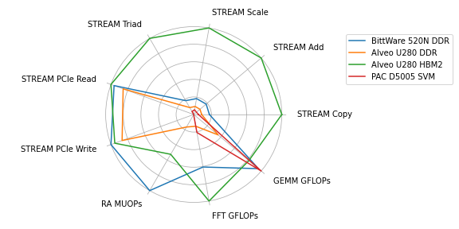

.. HPCC FPGA documentation master file, created by
   sphinx-quickstart on Thu Mar 26 10:51:40 2020.
   You can adapt this file completely to your liking, but it should at least
   contain the root `toctree` directive.

=============================================
HPCC FPGA Documentation
=============================================

In the last years, FPGAs with support for OpenCL-based high-level synthesis emerged as a new promising accelerator for high-performance computing applications.
This benchmarks suite uses the benchmarks defined in the HPC Challenge benchmark suite proposed in [LUS05]_ to implement parametrizable OpenCL kernels.
The parametrization of the kernels provided by the base implementation enables better resource utilization on a broad range of Intel and Xilinx FPGA boards without manual changes in the source code.
All source code for the benchmarks and this documentation are available on `GitHub <https://github.com/pc2/HPCC_FPGA>`_.

.. _overall_result_plot:

  Radar plot that contains the normalized results for the benchmarks STREAM, RandomAccess, FFT, and GEMM executed on three different boards and memory types.

The pages collected under **Benchmark Descriptions** contain information about the base implementation for all benchmarks of the benchmark suite.
**Technical Support** tackles selected topics of configuration, build, and execution of the benchmarks.
**Benchmark Results** for the base implementations of the benchmarks are listed at the bottom of this page. They are reported together with the used CPU and other relevant infrastructure, as well as the configuration and resource utilization of the bitstreams.

The scalability and performance of applications executed over multiple FPGAs is not least dependent on the communication capabilities of these devices. The benchmark suite supports the implementation of different communication strategies to compare their impact on the overall benchmark performance. This is only available to the benchmarks which rely on communication: b_eff, PTRANS and LINPACK.

The first and most obvious strategy is host-to-host communication using PCIe and MPI. This strategy requires, in most cases, no additional hardware or software and only relies on moving data between the host and FPGA.
The data is then exchanged via the existing CPU network, which makes it broadly appliable in the HPC context.
As a consequence, this approach is used for the base implementations in this benchmark suite.
For comparison, the suite can be extended with different communication types. 
Intel is providing external channels for direct communication between the FPGAs. 
This approach is based on point-to-point connections between FPGA and requires manual routing of data through the network.

Further optimized implementations that use such device-specific communication approaches will be added in the future to the suite.

.. toctree::
   :maxdepth: 1
   :caption: Benchmark Descriptions:
   :glob:

   STREAM/*
   RandomAccess/*
   FFT/*
   GEMM/*
   PTRANS/*
   LINPACK/*
   b_eff/*

.. toctree::
   :maxdepth: 1
   :caption: Technical Support:
   :glob:

   technical_support/*/*

.. toctree::
   :maxdepth: 1
   :caption: Benchmark Results:
   :glob:

   */results/index

   
----------
References
----------

.. [LUS05] LUSZCZEK, Piotr, et al. `Introduction to the HPC Challenge benchmark suite`. Ernest Orlando Lawrence Berkeley NationalLaboratory, Berkeley, CA (US), 2005.

